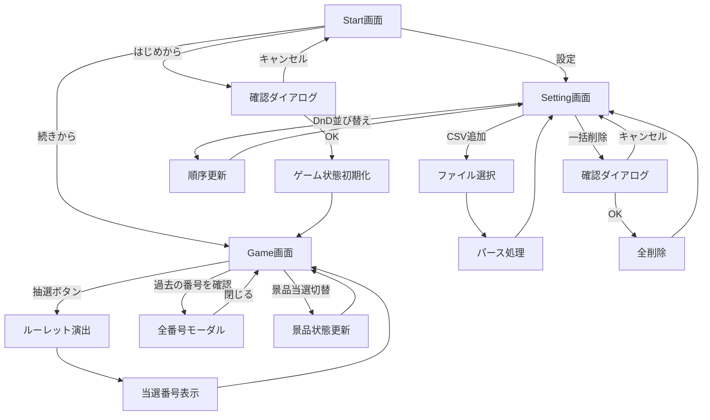
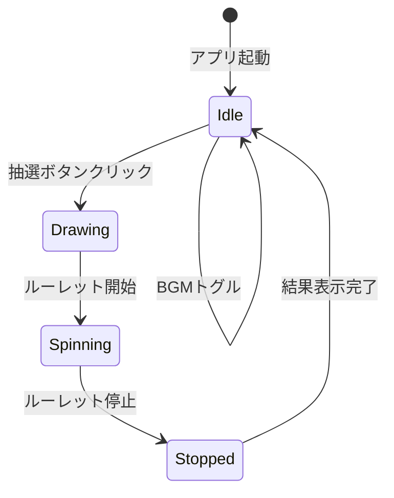
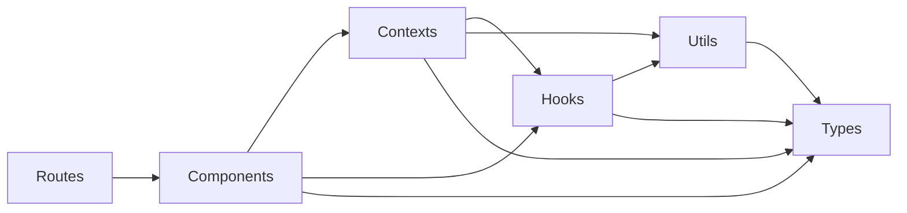

# デザイン文書

## 概要

新年会用Bingo抽選アプリケーションは、React + React Router v7をベースとしたシングルページアプリケーションです。ローカル環境で完結し、localStorageを使用してゲーム状態を永続化します。

### 主要な技術選定

- **フロントエンドフレームワーク**: React 18+ with TypeScript
- **ルーティング**: React Router v7
- **状態管理**: React Context API + localStorage
- **UI演出**: react-custom-roulette（抽選ルーレット）
- **アイコン**: @mui/icons-material
- **DnD**: @dnd-kit/core（景品並び替え）
- **スタイリング**: CSS Modules または Tailwind CSS

## アーキテクチャ

### システム構成図

```
┌─────────────────────────────────────────┐
│         Browser (Chrome)                │
│  ┌───────────────────────────────────┐  │
│  │   React Application               │  │
│  │  ┌─────────────────────────────┐  │  │
│  │  │  React Router v7            │  │  │
│  │  │  - Start Route              │  │  │
│  │  │  - Game Route               │  │  │
│  │  │  - Setting Route            │  │  │
│  │  └─────────────────────────────┘  │  │
│  │  ┌─────────────────────────────┐  │  │
│  │  │  State Management           │  │  │
│  │  │  - GameContext              │  │  │
│  │  │  - PrizeContext             │  │  │
│  │  │  - BGMContext               │  │  │
│  │  └─────────────────────────────┘  │  │
│  └───────────────────────────────────┘  │
│  ┌───────────────────────────────────┐  │
│  │   localStorage                    │  │
│  │  - gameState                      │  │
│  │  - prizes                         │  │
│  │  - bgmSettings                    │  │
│  └───────────────────────────────────┘  │
└─────────────────────────────────────────┘
```


### ディレクトリ構成

```
app/
├── routes/
│   ├── _index.tsx          # Start画面（/）
│   ├── game.tsx            # Game画面（/game）
│   └── setting.tsx         # Setting画面（/setting）
├── components/
│   ├── start/
│   │   ├── StartMenu.tsx
│   │   └── BGMToggle.tsx
│   ├── game/
│   │   ├── BingoBoard.tsx
│   │   ├── RouletteWheel.tsx
│   │   ├── NumberHistory.tsx
│   │   ├── AllNumbersModal.tsx
│   │   └── PrizeList.tsx
│   ├── setting/
│   │   ├── PrizeTable.tsx
│   │   ├── PrizeRow.tsx
│   │   └── CSVUploader.tsx
│   └── common/
│       ├── Modal.tsx
│       ├── Button.tsx
│       └── ConfirmDialog.tsx
├── common/
│   ├── contexts/
│   │   ├── GameContext.tsx
│   │   ├── PrizeContext.tsx
│   │   └── BGMContext.tsx
│   ├── hooks/
│   │   ├── useLocalStorage.ts
│   │   ├── useBingoEngine.ts
│   │   └── useBGM.ts
│   ├── types/
│   │   ├── game.ts
│   │   ├── prize.ts
│   │   └── index.ts
│   └── utils/
│       ├── csvParser.ts
│       ├── storage.ts
│       └── bingoEngine.ts
├── data/
│   └── prizes.csv          # 景品マスタデータ
└── public/
    └── audio/
        └── bgm.mp3         # BGM音源
```

## コンポーネントとインターフェース

### 1. Start画面コンポーネント

#### StartMenu.tsx
```typescript
interface StartMenuProps {
  onStartNew: () => void;
  onContinue: () => void;
  onSettings: () => void;
  hasSavedGame: boolean;
}
```

**責務**:
- メニューボタンの表示と操作
- 保存されたゲーム状態の有無に応じた表示制御


#### BGMToggle.tsx
```typescript
interface BGMToggleProps {
  isPlaying: boolean;
  onToggle: () => void;
}
```

**責務**:
- BGMのオン・オフ状態の視覚的表示
- @mui/icons-materialのVolumeUpとVolumeOffアイコンの切り替え

### 2. Game画面コンポーネント

#### BingoBoard.tsx
```typescript
interface BingoBoardProps {
  currentNumber: number | null;
  isDrawing: boolean;
  onDraw: () => void;
  onStop: () => void;
}
```

**責務**:
- 中央の当選番号表示エリア
- 抽選ボタンの制御
- 抽選中のアニメーション表示

#### RouletteWheel.tsx
```typescript
interface RouletteWheelProps {
  isSpinning: boolean;
  prizeNumber: number;
  onStopSpinning: (number: number) => void;
}
```

**責務**:
- react-custom-rouletteを使用したルーレット演出
- 抽選結果の決定と通知

#### NumberHistory.tsx
```typescript
interface NumberHistoryProps {
  recentNumbers: number[];
  onShowAll: () => void;
}
```

**責務**:
- 直近10件の当選番号表示
- 「これまでの当選番号を見る」リンク表示

#### AllNumbersModal.tsx
```typescript
interface AllNumbersModalProps {
  isOpen: boolean;
  allNumbers: number[];
  onClose: () => void;
}
```

**責務**:
- すべての当選番号の一覧表示
- モーダルの開閉制御


#### PrizeList.tsx
```typescript
interface Prize {
  id: string;
  order: number;
  prizeName: string;
  itemName: string;
  imagePath?: string;
  selected: boolean;
  memo?: string;
}

interface PrizeListProps {
  prizes: Prize[];
  onToggleSelected: (id: string) => void;
}
```

**責務**:
- 景品一覧の表示
- 当選済み景品の取消線表示
- 当選状態の切り替え

### 3. Setting画面コンポーネント

#### PrizeTable.tsx
```typescript
interface PrizeTableProps {
  prizes: Prize[];
  onReorder: (prizes: Prize[]) => void;
  onDelete: (id: string) => void;
  onDeleteAll: () => void;
  onAddFromCSV: (file: File) => void;
}
```

**責務**:
- 景品情報のテーブル表示（CSS Grid/Flexbox使用）
- DnDによる並び替え機能の提供
- 一括操作の制御

#### PrizeRow.tsx
```typescript
interface PrizeRowProps {
  prize: Prize;
  onDelete: (id: string) => void;
  isDragging: boolean;
}
```

**責務**:
- 個別の景品行の表示
- ドラッグハンドルの表示
- 削除ボタンの制御

#### CSVUploader.tsx
```typescript
interface CSVUploaderProps {
  onUpload: (prizes: Prize[]) => void;
}
```

**責務**:
- CSVファイルのアップロード
- CSVデータのパースと検証
- エラーハンドリング


## データモデル

### GameState
```typescript
interface GameState {
  drawnNumbers: number[];        // 抽選済み番号の配列
  currentNumber: number | null;  // 現在の当選番号
  isDrawing: boolean;            // 抽選中フラグ
  minNumber: number;             // 最小番号（デフォルト: 1）
  maxNumber: number;             // 最大番号（デフォルト: 75）
}
```

### Prize
```typescript
interface Prize {
  id: string;           // 一意なID（UUID）
  order: number;        // 表示順序
  prizeName: string;    // 賞名（例: 一等、特別賞）
  itemName: string;     // 商品名（例: Nintendo Switch）
  imagePath?: string;   // 商品画像パス（任意）
  selected: boolean;    // 当選済みフラグ
  memo?: string;        // 備考（任意）
}
```

### BGMSettings
```typescript
interface BGMSettings {
  isEnabled: boolean;   // BGMのオン・オフ
  volume: number;       // 音量（0.0 - 1.0）
}
```

### CSVFormat
```csv
id,order,prizeName,itemName,imagePath,selected,memo
uuid-1,1,一等,Nintendo Switch,/images/switch.jpg,false,
uuid-2,2,二等,商品券10000円,/images/voucher.jpg,false,
uuid-3,3,三等,お菓子詰め合わせ,/images/snacks.jpg,false,
```

## エラーハンドリング

### 1. localStorage関連エラー

**エラーケース**:
- localStorageが利用不可（プライベートモード等）
- 容量制限超過
- データ破損

**対応**:
```typescript
try {
  localStorage.setItem(key, value);
} catch (error) {
  console.error('localStorage保存エラー:', error);
  // メモリ上の状態のみで動作を継続
  // ユーザーへ警告メッセージを表示
}
```


### 2. CSV読み込みエラー

**エラーケース**:
- ファイル形式が不正
- 必須カラムの欠損
- データ型の不一致

**対応**:
```typescript
function parseCSV(file: File): Promise<Prize[]> {
  return new Promise((resolve, reject) => {
    // CSVパース処理
    // バリデーション
    if (!isValidCSV(data)) {
      reject(new Error('CSVフォーマットが不正です'));
    }
    resolve(parsedPrizes);
  });
}
```

### 3. 抽選エンジンエラー

**エラーケース**:
- すべての番号が抽選済み
- 番号範囲の設定ミス

**対応**:
```typescript
function drawNumber(drawnNumbers: number[], maxNumber: number): number {
  const availableNumbers = getAvailableNumbers(drawnNumbers, maxNumber);
  
  if (availableNumbers.length === 0) {
    throw new Error('すべての番号が抽選済みです');
  }
  
  return availableNumbers[Math.floor(Math.random() * availableNumbers.length)];
}
```

### 4. BGM再生エラー

**エラーケース**:
- 音源ファイルが見つからない
- ブラウザの自動再生ポリシー違反

**対応**:
```typescript
async function playBGM(audioElement: HTMLAudioElement) {
  try {
    await audioElement.play();
  } catch (error) {
    console.warn('BGM自動再生がブロックされました:', error);
    // ユーザー操作後に再生を試みる
  }
}
```

## テスト戦略

### 1. ユニットテスト

**対象**:
- `bingoEngine.ts`: 抽選ロジック、重複防止
- `csvParser.ts`: CSVパース、バリデーション
- `storage.ts`: localStorage操作

**ツール**: Vitest

**テストケース例**:
```typescript
describe('bingoEngine', () => {
  test('未抽選の番号からランダムに選択する', () => {
    const drawnNumbers = [1, 2, 3];
    const result = drawNumber(drawnNumbers, 75);
    expect(result).toBeGreaterThanOrEqual(4);
    expect(result).toBeLessThanOrEqual(75);
  });

  test('すべて抽選済みの場合はエラーを投げる', () => {
    const drawnNumbers = Array.from({ length: 75 }, (_, i) => i + 1);
    expect(() => drawNumber(drawnNumbers, 75)).toThrow();
  });
});
```


### 2. コンポーネントテスト

**対象**:
- Start画面: ボタンクリック、画面遷移
- Game画面: 抽選実行、履歴表示、景品管理
- Setting画面: DnD、CSV読み込み

**ツール**: Vitest + React Testing Library

**テストケース例**:
```typescript
describe('StartMenu', () => {
  test('「はじめから」ボタンクリックで新規ゲーム開始', () => {
    const onStartNew = vi.fn();
    render(<StartMenu onStartNew={onStartNew} />);
    
    fireEvent.click(screen.getByText('はじめから'));
    expect(onStartNew).toHaveBeenCalled();
  });
});
```

### 3. E2Eテスト

**シナリオ**:
1. Start画面から「はじめから」でゲーム開始
2. Game画面で抽選を3回実行
3. 景品を1つ当選済みにする
4. ブラウザをリロード
5. 「続きから」で状態が復元されることを確認

**ツール**: Playwright または Cypress

## 状態管理の詳細設計

### GameContext

```typescript
interface GameContextValue {
  gameState: GameState;
  drawNumber: () => void;
  resetGame: () => void;
  loadGame: () => void;
}

const GameContext = createContext<GameContextValue | undefined>(undefined);

export function GameProvider({ children }: { children: ReactNode }) {
  const [gameState, setGameState] = useLocalStorage<GameState>('gameState', {
    drawnNumbers: [],
    currentNumber: null,
    isDrawing: false,
    minNumber: 1,
    maxNumber: 75,
  });

  const drawNumber = useCallback(() => {
    // 抽選ロジック
  }, [gameState]);

  const resetGame = useCallback(() => {
    setGameState({
      drawnNumbers: [],
      currentNumber: null,
      isDrawing: false,
      minNumber: 1,
      maxNumber: 75,
    });
  }, []);

  return (
    <GameContext.Provider value={{ gameState, drawNumber, resetGame, loadGame }}>
      {children}
    </GameContext.Provider>
  );
}
```


### PrizeContext

```typescript
interface PrizeContextValue {
  prizes: Prize[];
  addPrizes: (prizes: Prize[]) => void;
  updatePrize: (id: string, updates: Partial<Prize>) => void;
  deletePrize: (id: string) => void;
  deleteAllPrizes: () => void;
  reorderPrizes: (prizes: Prize[]) => void;
  toggleSelected: (id: string) => void;
}

const PrizeContext = createContext<PrizeContextValue | undefined>(undefined);

export function PrizeProvider({ children }: { children: ReactNode }) {
  const [prizes, setPrizes] = useLocalStorage<Prize[]>('prizes', []);

  const toggleSelected = useCallback((id: string) => {
    setPrizes(prev =>
      prev.map(prize =>
        prize.id === id ? { ...prize, selected: !prize.selected } : prize
      )
    );
  }, []);

  // その他のメソッド実装

  return (
    <PrizeContext.Provider value={{ prizes, addPrizes, updatePrize, deletePrize, deleteAllPrizes, reorderPrizes, toggleSelected }}>
      {children}
    </PrizeContext.Provider>
  );
}
```

### BGMContext

```typescript
interface BGMContextValue {
  settings: BGMSettings;
  toggleBGM: () => void;
  setVolume: (volume: number) => void;
}

const BGMContext = createContext<BGMContextValue | undefined>(undefined);

export function BGMProvider({ children }: { children: ReactNode }) {
  const [settings, setSettings] = useLocalStorage<BGMSettings>('bgmSettings', {
    isEnabled: false,
    volume: 0.5,
  });

  const audioRef = useRef<HTMLAudioElement | null>(null);

  useEffect(() => {
    if (!audioRef.current) {
      audioRef.current = new Audio('/audio/bgm.mp3');
      audioRef.current.loop = true;
    }

    if (settings.isEnabled) {
      audioRef.current.play().catch(console.warn);
    } else {
      audioRef.current.pause();
    }
  }, [settings.isEnabled]);

  const toggleBGM = useCallback(() => {
    setSettings(prev => ({ ...prev, isEnabled: !prev.isEnabled }));
  }, []);

  return (
    <BGMContext.Provider value={{ settings, toggleBGM, setVolume }}>
      {children}
    </BGMContext.Provider>
  );
}
```


## カスタムフックの設計

### useLocalStorage

```typescript
function useLocalStorage<T>(key: string, initialValue: T): [T, (value: T | ((prev: T) => T)) => void] {
  const [storedValue, setStoredValue] = useState<T>(() => {
    try {
      const item = window.localStorage.getItem(key);
      return item ? JSON.parse(item) : initialValue;
    } catch (error) {
      console.error(`localStorage読み込みエラー (${key}):`, error);
      return initialValue;
    }
  });

  const setValue = useCallback((value: T | ((prev: T) => T)) => {
    try {
      const valueToStore = value instanceof Function ? value(storedValue) : value;
      setStoredValue(valueToStore);
      window.localStorage.setItem(key, JSON.stringify(valueToStore));
    } catch (error) {
      console.error(`localStorage保存エラー (${key}):`, error);
    }
  }, [key, storedValue]);

  return [storedValue, setValue];
}
```

### useBingoEngine

```typescript
interface UseBingoEngineReturn {
  drawNumber: () => number;
  getAvailableNumbers: () => number[];
  isAllDrawn: () => boolean;
}

function useBingoEngine(drawnNumbers: number[], minNumber: number, maxNumber: number): UseBingoEngineReturn {
  const getAvailableNumbers = useCallback(() => {
    const allNumbers = Array.from({ length: maxNumber - minNumber + 1 }, (_, i) => i + minNumber);
    return allNumbers.filter(num => !drawnNumbers.includes(num));
  }, [drawnNumbers, minNumber, maxNumber]);

  const drawNumber = useCallback(() => {
    const available = getAvailableNumbers();
    if (available.length === 0) {
      throw new Error('すべての番号が抽選済みです');
    }
    return available[Math.floor(Math.random() * available.length)];
  }, [getAvailableNumbers]);

  const isAllDrawn = useCallback(() => {
    return getAvailableNumbers().length === 0;
  }, [getAvailableNumbers]);

  return { drawNumber, getAvailableNumbers, isAllDrawn };
}
```

### useBGM

```typescript
interface UseBGMReturn {
  play: () => Promise<void>;
  pause: () => void;
  setVolume: (volume: number) => void;
}

function useBGM(audioSrc: string): UseBGMReturn {
  const audioRef = useRef<HTMLAudioElement | null>(null);

  useEffect(() => {
    audioRef.current = new Audio(audioSrc);
    audioRef.current.loop = true;
    return () => {
      audioRef.current?.pause();
      audioRef.current = null;
    };
  }, [audioSrc]);

  const play = useCallback(async () => {
    if (audioRef.current) {
      try {
        await audioRef.current.play();
      } catch (error) {
        console.warn('BGM再生エラー:', error);
      }
    }
  }, []);

  const pause = useCallback(() => {
    audioRef.current?.pause();
  }, []);

  const setVolume = useCallback((volume: number) => {
    if (audioRef.current) {
      audioRef.current.volume = Math.max(0, Math.min(1, volume));
    }
  }, []);

  return { play, pause, setVolume };
}
```


## ユーティリティ関数の設計

### csvParser.ts

```typescript
interface CSVRow {
  id?: string;
  order?: string;
  prizeName: string;
  itemName: string;
  imagePath?: string;
  selected?: string;
  memo?: string;
}

export function parseCSV(csvText: string): Prize[] {
  const lines = csvText.trim().split('\n');
  const headers = lines[0].split(',').map(h => h.trim());
  
  const prizes: Prize[] = [];
  
  for (let i = 1; i < lines.length; i++) {
    const values = lines[i].split(',').map(v => v.trim());
    const row: CSVRow = {};
    
    headers.forEach((header, index) => {
      row[header as keyof CSVRow] = values[index];
    });
    
    // バリデーション
    if (!row.prizeName || !row.itemName) {
      throw new Error(`行${i + 1}: 必須項目が不足しています`);
    }
    
    prizes.push({
      id: row.id || crypto.randomUUID(),
      order: row.order ? parseInt(row.order, 10) : i,
      prizeName: row.prizeName,
      itemName: row.itemName,
      imagePath: row.imagePath,
      selected: row.selected === 'true',
      memo: row.memo,
    });
  }
  
  return prizes;
}

export function exportCSV(prizes: Prize[]): string {
  const headers = ['id', 'order', 'prizeName', 'itemName', 'imagePath', 'selected', 'memo'];
  const rows = prizes.map(prize => [
    prize.id,
    prize.order.toString(),
    prize.prizeName,
    prize.itemName,
    prize.imagePath || '',
    prize.selected.toString(),
    prize.memo || '',
  ]);
  
  return [headers, ...rows].map(row => row.join(',')).join('\n');
}
```

### bingoEngine.ts

```typescript
export function getAvailableNumbers(drawnNumbers: number[], minNumber: number, maxNumber: number): number[] {
  const allNumbers = Array.from({ length: maxNumber - minNumber + 1 }, (_, i) => i + minNumber);
  return allNumbers.filter(num => !drawnNumbers.includes(num));
}

export function drawRandomNumber(availableNumbers: number[]): number {
  if (availableNumbers.length === 0) {
    throw new Error('利用可能な番号がありません');
  }
  return availableNumbers[Math.floor(Math.random() * availableNumbers.length)];
}

export function isAllNumbersDrawn(drawnNumbers: number[], minNumber: number, maxNumber: number): boolean {
  return drawnNumbers.length >= (maxNumber - minNumber + 1);
}
```


### storage.ts

```typescript
export function saveToLocalStorage<T>(key: string, value: T): void {
  try {
    const serialized = JSON.stringify(value);
    window.localStorage.setItem(key, serialized);
  } catch (error) {
    console.error(`localStorage保存エラー (${key}):`, error);
    throw error;
  }
}

export function loadFromLocalStorage<T>(key: string, defaultValue: T): T {
  try {
    const item = window.localStorage.getItem(key);
    return item ? JSON.parse(item) : defaultValue;
  } catch (error) {
    console.error(`localStorage読み込みエラー (${key}):`, error);
    return defaultValue;
  }
}

export function removeFromLocalStorage(key: string): void {
  try {
    window.localStorage.removeItem(key);
  } catch (error) {
    console.error(`localStorage削除エラー (${key}):`, error);
  }
}

export function clearAllGameData(): void {
  removeFromLocalStorage('gameState');
  removeFromLocalStorage('prizes');
  removeFromLocalStorage('bgmSettings');
}
```

## UI/UXデザインの実装方針

### デザインシステム

**カラーパレット**（docs/design配下の画像から抽出）:
- プライマリ: ビンゴらしい明るい色調
- セカンダリ: アクセントカラー
- 背景: 白またはライトグレー
- テキスト: ダークグレー

**タイポグラフィ**:
- 見出し: 大きく読みやすいフォント
- 本文: 標準的なサイズ
- 当選番号: 特大サイズで強調

**レイアウト**:
- Start画面: 中央配置のメニュー、右上にBGMトグル
- Game画面: 3カラムレイアウト（左: 履歴、中央: 抽選エリア、右: 景品）
- Setting画面: テーブル形式の景品リスト

### レスポンシブ対応

プロジェクタ投影を想定しているため、デスクトップサイズ（1920x1080以上）を優先。
モバイル対応は必須ではないが、タブレットサイズでも閲覧可能にする。


## React Router v7の実装詳細

### ルート定義

#### app/routes/_index.tsx (Start画面)

```typescript
import { redirect } from 'react-router';
import type { Route } from './+types/_index';
import StartMenu from '~/components/start/StartMenu';
import BGMToggle from '~/components/start/BGMToggle';

export function loader({ request }: Route.LoaderArgs) {
  // localStorageの確認はクライアントサイドで行う
  return null;
}

export default function StartRoute() {
  return (
    <div className="start-screen">
      <BGMToggle />
      <StartMenu />
    </div>
  );
}
```

#### app/routes/game.tsx (Game画面)

```typescript
import type { Route } from './+types/game';
import BingoBoard from '~/components/game/BingoBoard';
import NumberHistory from '~/components/game/NumberHistory';
import PrizeList from '~/components/game/PrizeList';

export function loader({ request }: Route.LoaderArgs) {
  // ゲーム状態の読み込みはContextで行う
  return null;
}

export default function GameRoute() {
  return (
    <div className="game-screen">
      <aside className="history-panel">
        <NumberHistory />
      </aside>
      <main className="bingo-board">
        <BingoBoard />
      </main>
      <aside className="prize-panel">
        <PrizeList />
      </aside>
    </div>
  );
}
```

#### app/routes/setting.tsx (Setting画面)

```typescript
import type { Route } from './+types/setting';
import PrizeTable from '~/components/setting/PrizeTable';

export function loader({ request }: Route.LoaderArgs) {
  return null;
}

export default function SettingRoute() {
  return (
    <div className="setting-screen">
      <h1>景品設定</h1>
      <PrizeTable />
    </div>
  );
}
```


## パフォーマンス最適化

### 1. メモ化戦略

```typescript
// 高頻度で再レンダリングされるコンポーネントをメモ化
export const PrizeRow = memo(function PrizeRow({ prize, onDelete }: PrizeRowProps) {
  // コンポーネント実装
});

// 計算コストの高い処理をメモ化
const availableNumbers = useMemo(() => {
  return getAvailableNumbers(drawnNumbers, minNumber, maxNumber);
}, [drawnNumbers, minNumber, maxNumber]);
```

### 2. 遅延ローディング

```typescript
// モーダルコンポーネントの遅延ローディング
const AllNumbersModal = lazy(() => import('~/components/game/AllNumbersModal'));
```

### 3. 仮想化

景品リストが大量になる場合は、react-windowやreact-virtualized-autoを使用して仮想スクロールを実装。

## セキュリティ考慮事項

### 1. XSS対策

- ユーザー入力（景品名、商品名等）は常にエスケープ
- dangerouslySetInnerHTMLは使用しない

### 2. CSVインジェクション対策

```typescript
function sanitizeCSVValue(value: string): string {
  // 先頭の特殊文字（=, +, -, @）を除去
  return value.replace(/^[=+\-@]/, '');
}
```

### 3. localStorage容量制限

- 定期的にデータサイズをチェック
- 容量超過時は古いデータを削除または警告表示

## デプロイメント

### ビルド設定

```json
{
  "scripts": {
    "dev": "react-router dev",
    "build": "react-router build",
    "start": "react-router-serve ./build/server/index.js"
  }
}
```

### 静的ファイル配置

```
public/
├── audio/
│   └── bgm.mp3
├── images/
│   ├── switch.jpg
│   ├── voucher.jpg
│   └── snacks.jpg
└── favicon.ico
```

### 環境変数

```env
# 開発環境
NODE_ENV=development

# 本番環境
NODE_ENV=production
```


## 画面フロー図



## 状態遷移図



## 依存関係図



## まとめ

このデザイン文書では、新年会用Bingo抽選アプリケーションの技術的な設計を詳細に定義しました。

**主要な設計決定**:
1. React Router v7を使用した3画面構成
2. Context APIによる状態管理とlocalStorageによる永続化
3. react-custom-rouletteによる抽選演出
4. @dnd-kit/coreによるDnD機能
5. CSV形式での景品マスタ管理

**次のステップ**:
実装計画（tasks.md）の作成に進み、具体的な実装タスクを定義します。
