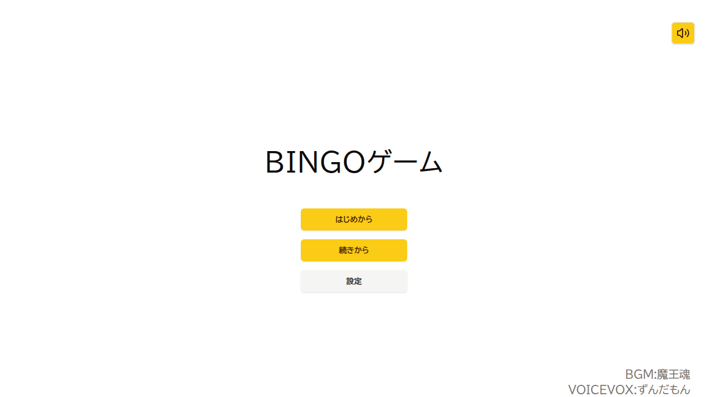
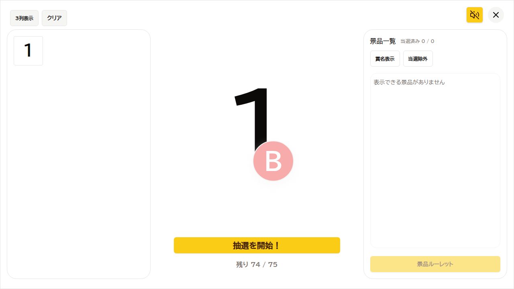
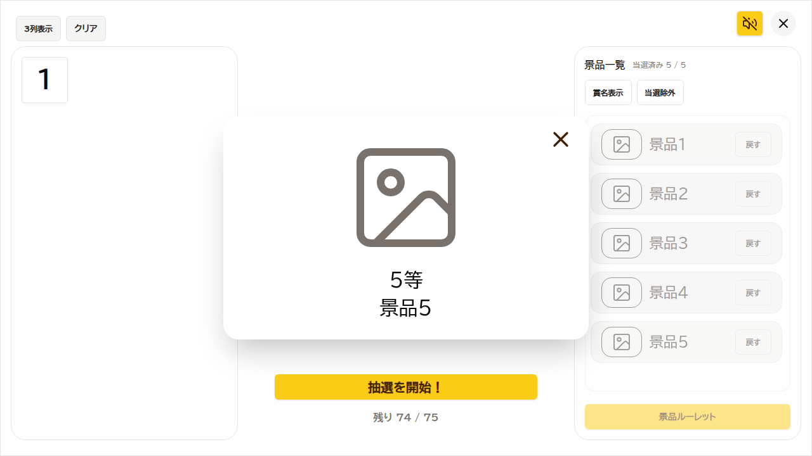
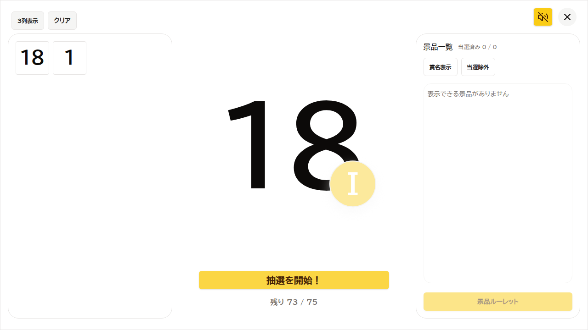

# テスト結果（2026-02-23）

## 実行サマリ

| レイヤー | 実行日 | コマンド/確認 | 結果 | 備考 |
| --- | --- | --- | --- | --- |
| Vitest（単体/ルートUI） | 2026-02-23 | `npm test` | 成功 | 8 files / 30 tests passed |
| Playwright（E2E） | 2026-02-23 | `npm run test:e2e`（再実行） | 成功 | 3 tests passed（証跡添付対応後） |
| 全画面ウォークスルー（Playwright） | 2026-02-23 | `npx playwright test tests/e2e/all-screens-walkthrough.spec.ts` | 成功 | 5 tests passed（全画面/主要ダイアログのスクショ添付） |
| Chrome DevTools MCP | 2026-02-23 | `codex mcp list` | 構成確認済 | `chrome-devtools` enabled |
| DTM-01〜03 観測 | 2026-02-23 | `npx playwright test tests/e2e/devtools-observability-dtm-01-03.spec.ts` | 成功 | DevTools MCP 代替（Playwrightで console/network 観測） |

## Vitest 実測結果（表）

| 項目 | 実測値 |
| --- | --- |
| Test Files | 8 passed |
| Tests | 30 passed |
| Duration | 約 1.63s（再実行時） |
| 実行コマンド | `npm test` |
| 補足ログ | `HTMLMediaElement.play/load` の jsdom 未実装メッセージあり（失敗要因ではない） |

## Vitest 対応ファイル結果

| ファイル | 結果 | 主対応チケット |
| --- | --- | --- |
| `app/common/utils/__tests__/bingoEngine.test.ts` | PASS | T-01 |
| `app/common/utils/__tests__/csvParser.test.ts` | PASS | T-04 |
| `app/common/utils/__tests__/storage.test.ts` | PASS | T-10 |
| `app/common/services/__tests__/sessionService.test.ts` | PASS | T-03, T-10 |
| `app/common/contexts/__tests__/PrizeContext.test.tsx` | PASS | T-06（周辺） |
| `app/routes/__tests__/start-route.test.tsx` | PASS | T-05 |
| `app/routes/__tests__/game-route.test.tsx` | PASS | T-05, T-07（UI導線の一部） |
| `app/routes/__tests__/setting-route.test.tsx` | PASS | T-06 |

## Playwright 実行準備状況（2026-02-23）

| 項目 | 状態 | 内容 |
| --- | --- | --- |
| 設定ファイル | 追加済 | `playwright.config.ts` |
| E2E spec | 追加済 | `tests/e2e/*.spec.ts`（3本） |
| package scripts | 追加済 | `test:e2e`, `test:e2e:headed`, `test:e2e:install` |
| 依存関係 | 導入済 | `@playwright/test@1.58.2` |
| browser binaries | 導入済 | `npx playwright install chromium` 実施 |
| 実行結果 | 取得済 | `3 passed (9.1s)` |

## Playwright 実測結果（表）

| 項目 | 実測値 |
| --- | --- |
| 実行コマンド | `npm run test:e2e` |
| 実行結果 | 3 passed |
| Duration | 約 10.8s（証跡添付・動画常時記録後） |
| 対象 | `start-and-setting`, `setting-csv-import`, `game-draw-smoke` |
| 備考 | `NO_COLOR/FORCE_COLOR` warning が表示されるが失敗要因ではない。各テストでスクリーンショット添付、動画を生成する設定に変更 |

## 全画面ウォークスルー実測結果（表）

| 項目 | 実測値 |
| --- | --- |
| 実行コマンド | `npx playwright test tests/e2e/all-screens-walkthrough.spec.ts` |
| 実行結果 | 5 passed |
| Duration | 約 9.9s |
| 目的 | 全画面の動作確認を兼ねたスクリーンショット記録 |
| 備考 | 主要画面 + 主要ダイアログ（Start/Setting/Game/Reset/StartOver/PrizeRoulette/PrizeResult）をカバー |

## 全画面ウォークスルーのキャプチャ対象

| ケース | キャプチャ内容 | 主な証跡（`test-results/`） |
| --- | --- | --- |
| Start screens and dialogs | 音量注意ダイアログ、Startメイン | `all-screens-walkthrough-...Start-screens-and-dialogs...` |
| Start resume/start-over dialog | `続きから` 表示、最初から確認ダイアログ | `all-screens-walkthrough-...resume-start-over-dialog...` |
| Setting screens | 設定画面（空）、CSV取込後 | `all-screens-walkthrough-...empty-and-after-CSV-import...` |
| Game main and reset dialog | Gameメイン、抽選クリア確認ダイアログ | `all-screens-walkthrough-...Game-main-and-reset-dialog...` |
| Prize dialogs | 景品ルーレット、景品結果ダイアログ | `all-screens-walkthrough-...prize-result-dialogs...` |

## エビデンス埋め込み（全画面ウォークスルー）

| ケース | スクリーンショット | 動画 |
| --- | --- | --- |
| Start screens and dialogs |  | [video.webm](../../test-results-evidence/all-screens/all-screens-walkthrough-al-580c5-s-Start-screens-and-dialogs-chromium/video.webm) |
| Start resume/start-over dialog |  | [video.webm](../../test-results-evidence/all-screens/all-screens-walkthrough-al-0bf3f-rt-resume-start-over-dialog-chromium/video.webm) |
| Setting screens |  | [video.webm](../../test-results-evidence/all-screens/all-screens-walkthrough-al-23a9b-empty-and-after-CSV-import--chromium/video.webm) |
| Game main and reset dialog |  | [video.webm](../../test-results-evidence/all-screens/all-screens-walkthrough-al-90058--Game-main-and-reset-dialog-chromium/video.webm) |
| Prize dialogs |  | [video.webm](../../test-results-evidence/all-screens/all-screens-walkthrough-al-8c664-te-and-prize-result-dialogs-chromium/video.webm) |

## DTM-01〜03 実測結果（Playwright代替観測）

| DTM ID | 実施方法 | 結果 | 主な確認項目 | 証跡 |
| --- | --- | --- | --- | --- |
| DTM-01 | `tests/e2e/devtools-observability-dtm-01-03.spec.ts` | PASS | Start→Setting で console error 0 / failed request 0 | `test-results/devtools-observability-*/dtm-01-*.json`, screenshot, video |
| DTM-02 | 同上 | PASS | CSV取込で console error 0 / failed request 0 / `/api`,`/session`,`/prizes` 通信なし | `test-results/devtools-observability-*/dtm-02-*.json`, screenshot, video |
| DTM-03 | 同上 | PASS | 抽選導線で console error 0 / failed request 0 | `test-results/devtools-observability-*/dtm-03-*.json`, screenshot, video |

## DTM-01〜03 補足

| 項目 | 内容 |
| --- | --- |
| 実施上の制約 | この実行環境では Chrome DevTools MCP を直接操作するツールが無いため、同等観測を Playwright (`page.on('console'/'request*')`) で代替 |
| 次の推奨 | 同じ3ケースを Chrome DevTools MCP で再実施し、trace/long task/network 詳細を追記 |

## エビデンス埋め込み（DTM-01〜03 代替観測）

| DTM ID | スクリーンショット | 動画 |
| --- | --- | --- |
| DTM-01 |  | [video.webm](../../test-results-evidence/dtm-01-03/devtools-observability-dtm-4b29b-ent-Start→Setting-console観測-chromium/video.webm) |
| DTM-02 |  | [video.webm](../../test-results-evidence/dtm-01-03/devtools-observability-dtm-16b2a-equivalent-CSV取込時のnetwork観測-chromium/video.webm) |
| DTM-03 |  | [video.webm](../../test-results-evidence/dtm-01-03/devtools-observability-dtm-21bad-lent-抽選導線のconsole-network観測-chromium/video.webm) |

## Chrome DevTools MCP 構成状況（2026-02-23）

| サーバー名 | 状態 | 用途 |
| --- | --- | --- |
| `chrome-devtools` | enabled | console/network/perf/debug 観測 |
| `playwright` | enabled | MCPベースのブラウザ操作（必要時） |
| `context7` | enabled | ライブラリ/ドキュメント参照 |
| `serena` | enabled | コード生成/リファクタリング支援 |

## 既知の未実施項目

| 対象 | 理由 | 次アクション |
| --- | --- | --- |
| Chrome DevTools MCP による同一観測の再計測 | 今回は Playwright 代替観測で実施 | `docs/testing/devtools-mcp-test-spec.md` の DTM-01〜03 を MCP で再実施して差分確認 |
