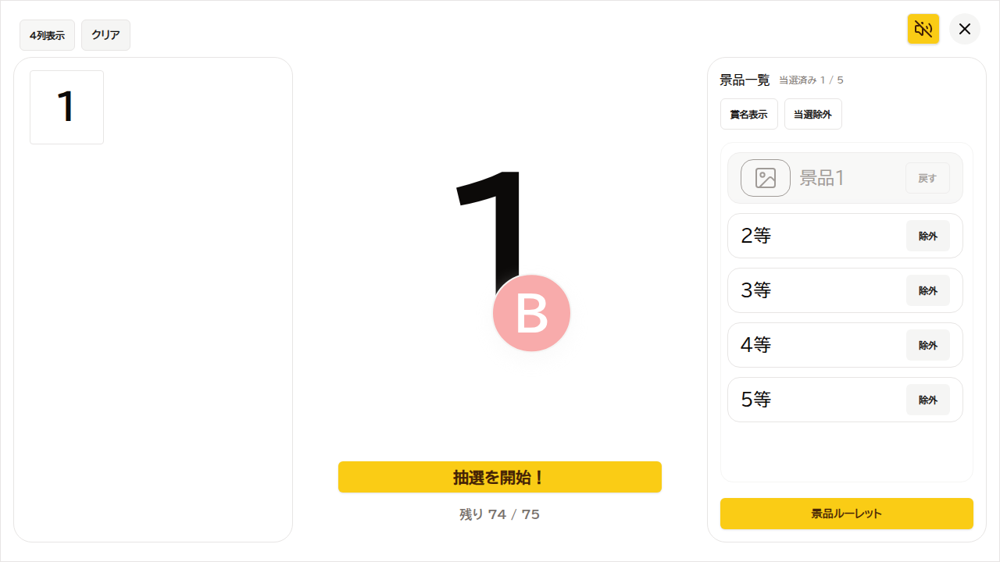
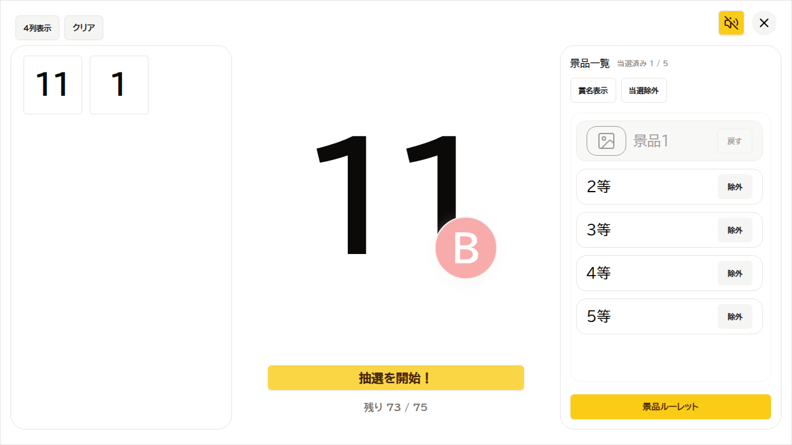
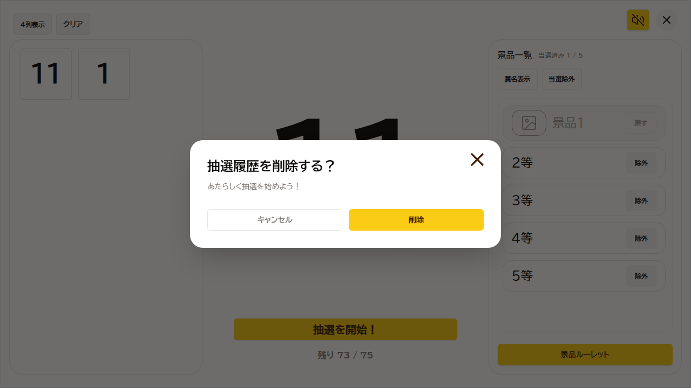
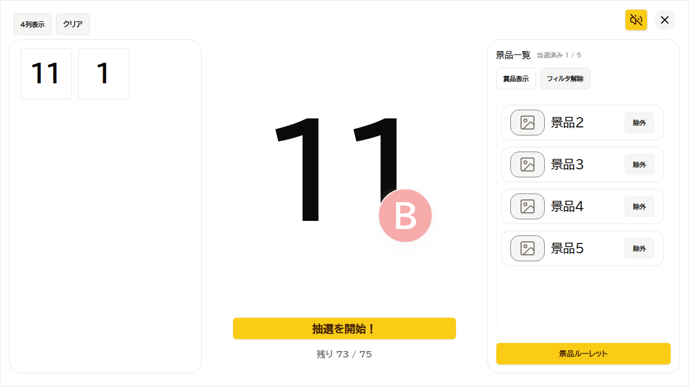
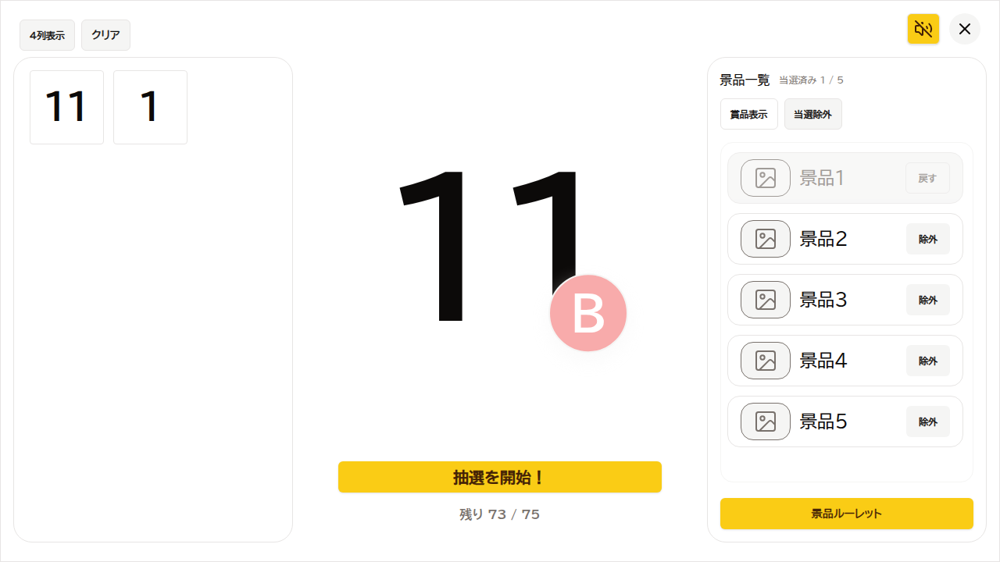
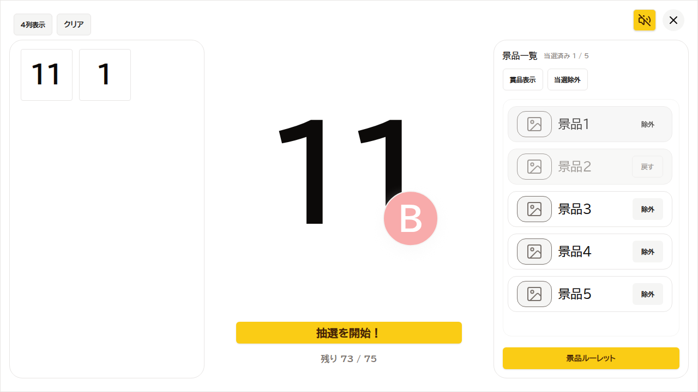
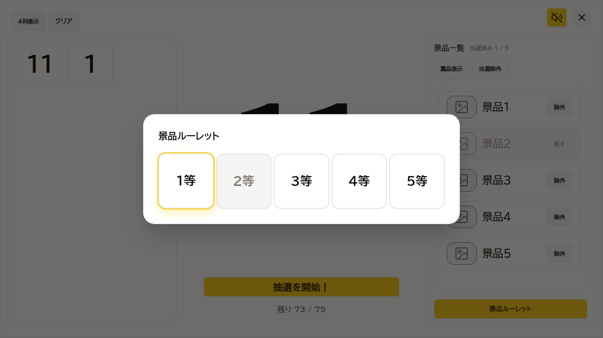

# Regression Report: game / all-functions
- Date: 2026-02-23 07:58:02.263
- Summary: Game画面の主要機能（抽選、履歴表示切替、クリア、景品パネル、ルーレット、結果表示、Start戻り）の回帰確認
- Setup Notes: sessionStorage/localStorage を seed して Game 画面を直接表示。景品一覧を事前投入し、ルーレット〜結果表示まで確認
- Video: Playwright video recorded in /home/chatno/workspace/bingo/test-results-evidence/regression-game/regression-full-app-regression-game-screen-functions-chromium/video.webm
## Steps
| # | Action (1 click) | Expected Result | Actual Result | Screenshot |
|---|------------------|-----------------|---------------|------------|
| 1 | Game画面で履歴列数トグル（N列表示）をクリック | 履歴列数トグルが切り替わりボタンラベルが変化する | PASS: 履歴列数トグル切替 |  |
| 2 | Game画面で「抽選を開始！」をクリック | 抽選後に残数表示が更新される | PASS: 残数が 74→73 に更新 |  |
| 3 | Game画面で「クリア」をクリック | 抽選履歴削除確認ダイアログが表示される | PASS: ResetDialog が表示 |  |
| 4 | 抽選履歴削除確認で「キャンセル」をクリック | 確認ダイアログが閉じる | PASS: ResetDialog を閉じた |  |
| 5 | 景品パネルで「賞名表示」をクリック | 表示切替ボタンのラベルが変わる | PASS: 表示切替ボタンが更新 |  |
| 6 | 景品パネルで「当選除外」をクリック | フィルタ状態が有効化されボタンラベルが変わる | PASS: 当選除外フィルタ有効化 |  |
| 7 | 景品パネルで「フィルタ解除」をクリック | フィルタが解除されボタンラベルが戻る | PASS: 当選除外フィルタ解除 |  |
| 8 | 景品一覧で「除外」をクリック | 対象景品のボタンが「戻す」に切り替わる | PASS: 景品の選出状態を切替 |  |
| 9 | 景品一覧で「戻す」をクリック | 対象景品のボタンが「除外」に戻る | PASS: 景品の選出状態を復元 |  |
| 10 | 景品パネルで「景品ルーレット」をクリック | 景品ルーレットダイアログが表示される | PASS: PrizeRouletteDialog が表示 |  |
| 11 | 景品結果ダイアログで「閉じる」をクリック | 景品結果ダイアログが閉じる | PASS: 景品結果ダイアログを閉じた |  |
| 12 | Game画面で「Start 画面に戻る」をクリック | Start 画面へ戻る | PASS: Start 画面へ遷移 |  |