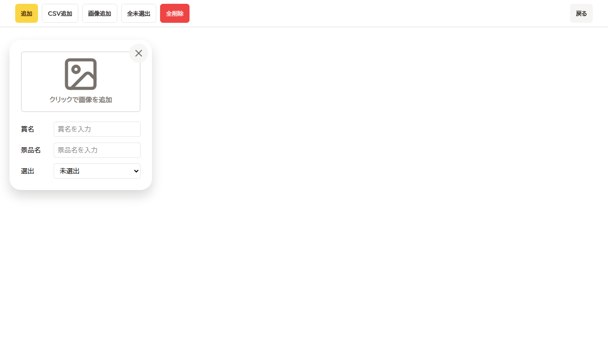
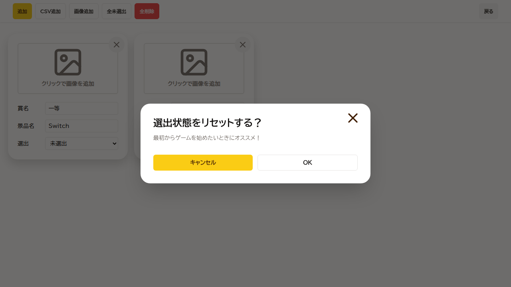
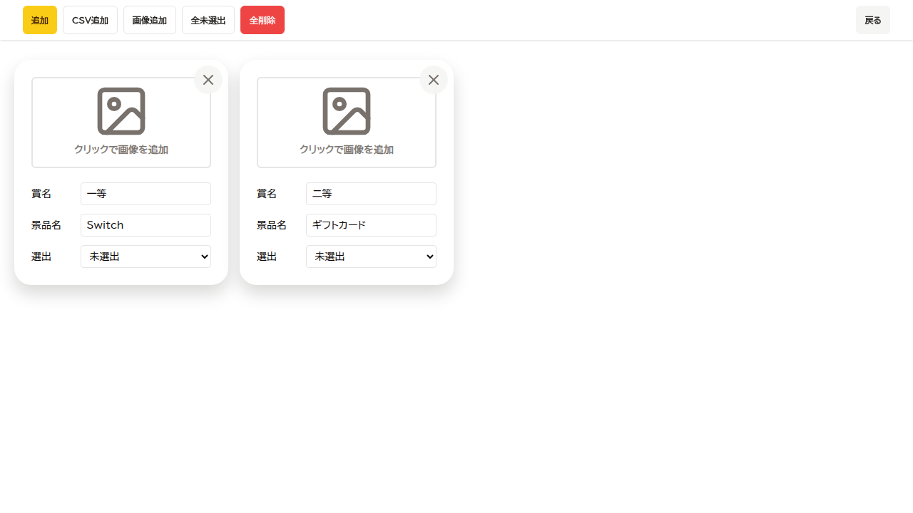
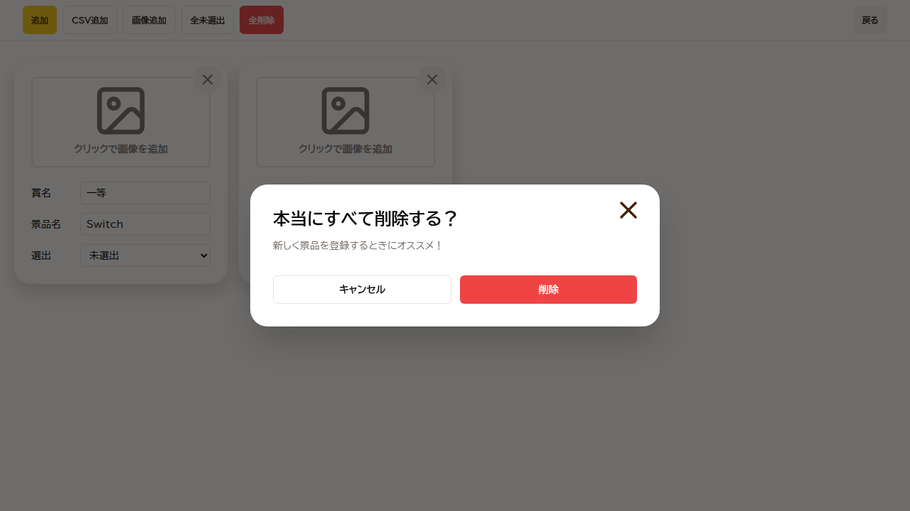
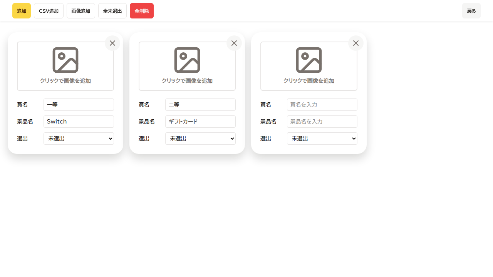

# Regression Report: setting / all-functions
- Date: 2026-02-23 07:57:42.155
- Summary: Setting画面の主要機能（追加、CSV取込、ダイアログ、未保存変更ガード）の回帰確認
- Setup Notes: ハッシュルート `/#/setting` で Setting 画面を直接表示。CSV取込は file input への setInputFiles（クリック以外の前提操作）で実施し、その後のUI操作を1クリック1スクショで記録
- Video: Playwright video recorded in /home/chatno/workspace/bingo/test-results-evidence/regression-setting/regression-full-app-regression-setting-screen-functions-chromium/video.webm
## Steps
| # | Action (1 click) | Expected Result | Actual Result | Screenshot |
|---|------------------|-----------------|---------------|------------|
| 1 | Setting画面で「追加」をクリック | 景品カード入力欄が1件追加される | PASS: 空の景品カードが追加 |  |
| 2 | CSV取込後に「全未選出」をクリック | 選出状態リセット確認ダイアログが表示される | PASS: ResetSelectionDialog が表示 |  |
| 3 | 選出状態リセット確認で「キャンセル」をクリック | 確認ダイアログが閉じて Setting 画面に戻る | PASS: ResetSelectionDialog を閉じた |  |
| 4 | Setting画面で「全削除」をクリック | 全削除確認ダイアログが表示される | PASS: DeleteAllDialog が表示 |  |
| 5 | 全削除確認で「キャンセル」をクリック | 全削除確認ダイアログが閉じる | PASS: DeleteAllDialog を閉じた |  |
| 6 | 戻る導線確認前に再度「追加」をクリック | 景品カードが追加され、画面上に入力欄が表示される | PASS: 景品カード追加 |  |
| 7 | Setting画面で「戻る」をクリック | Start 画面へ戻る | PASS: Start 画面へ遷移 |  |