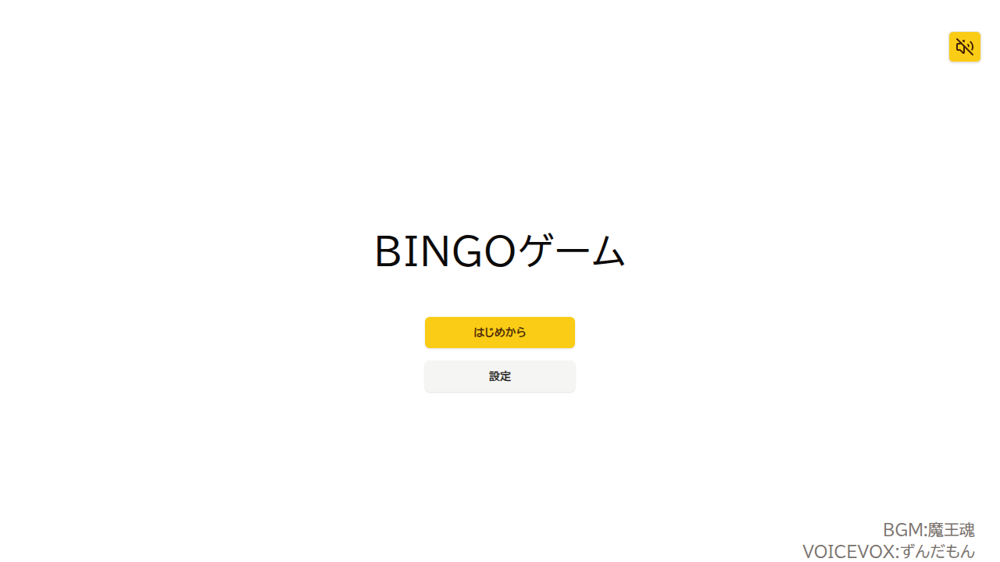
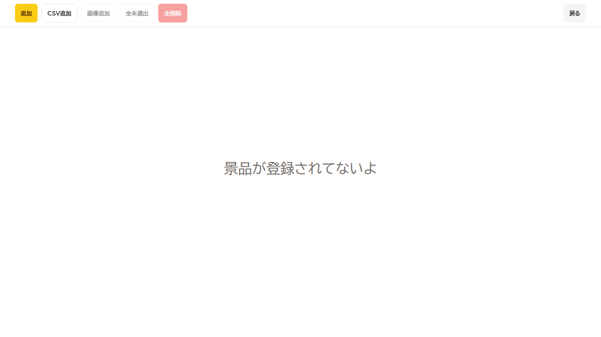
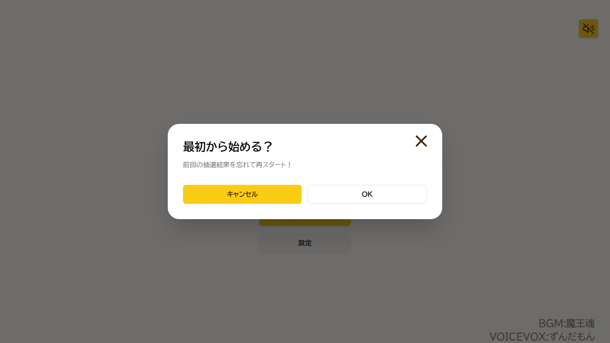
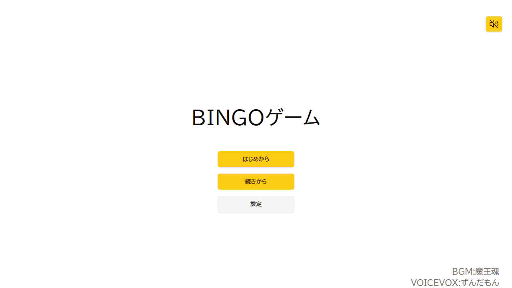
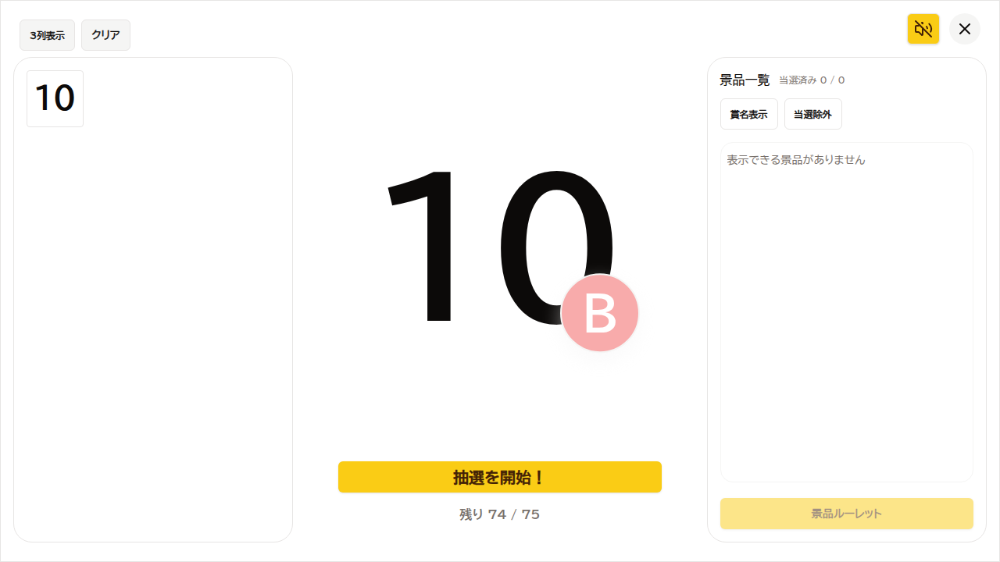

# Regression Report: start / all-functions
- Date: 2026-02-23 07:57:35.171
- Summary: Start画面の主要機能（音量注意、設定遷移、開始確認ダイアログ、続きから表示）の回帰確認
- Setup Notes: 事前に localStorage に保存済み gameState を seed して「続きから」を表示
- Video: Playwright video recorded in /home/chatno/workspace/bingo/test-results-evidence/regression-start/regression-full-app-regression-start-screen-functions-chromium/video.webm
## Steps
| # | Action (1 click) | Expected Result | Actual Result | Screenshot |
|---|------------------|-----------------|---------------|------------|
| 1 | 音量注意ダイアログで「音なし」をクリック | 音量注意ダイアログが閉じて Start 画面が表示される | PASS: Start 画面の見出しを確認 |  |
| 2 | Start画面で「設定」をクリック | Setting 画面へ遷移し「CSV追加」ボタンが表示される | PASS: Setting 画面に遷移 |  |
| 3 | Setting画面で「戻る」をクリック | Start 画面へ戻る（未変更のため確認ダイアログなし） | PASS: Start 画面に復帰 |  |
| 4 | Start画面で「はじめから」をクリック（保存済み状態あり） | 「最初から始める？」確認ダイアログが表示される | PASS: StartOverDialog が表示 |  |
| 5 | 開始確認ダイアログで「キャンセル」をクリック | 確認ダイアログが閉じ、Start 画面に戻る | PASS: ダイアログが閉じ、続きからボタン表示 |  |
| 6 | Start画面で「続きから」をクリック | Game 画面へ遷移し抽選ボタンが表示される | PASS: Game 画面へ遷移 |  |